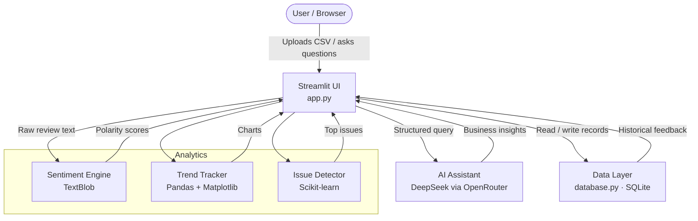

# BizInsight AI — Architecture

This document gives new contributors a quick mental model of how BizInsight AI is structured, how data flows through the system, and which files to open first.

---

## System Flow

---

## Layer Breakdown

### 1. Presentation — `app.py`
The single entry point. Streamlit renders every page, widget, and chart here. It orchestrates all other layers: it calls the sentiment engine, queries the database, invokes the AI assistant, and passes data to the analytics helpers. If you want to change what users see or how they interact with the app, start here.

### 2. Sentiment Engine — TextBlob
Runs automatically when a CSV is uploaded. Each review string is passed through TextBlob's polarity scorer, which returns a score between −1 (very negative) and +1 (very positive). The result is stored alongside the original review in SQLite for later trend queries.

### 3. Analytics — Pandas, Matplotlib, Scikit-learn
Three responsibilities live in this layer:
- **Trend tracking**: Pandas aggregates sentiment scores by date; Matplotlib renders the time-series chart.
- **Issue detection**: Scikit-learn (CountVectorizer) surfaces the most frequently mentioned words across all reviews.
- All analytics are computed on demand inside `app.py`; there is no separate analytics module yet.

### 4. AI Assistant — DeepSeek via OpenRouter
When a user asks a free-text question in the dashboard, `app.py` sends the question (plus relevant context from the database) to the DeepSeek model through the OpenRouter API. The model replies with business-oriented insights and suggestions. No fine-tuning is used; prompting is handled inline in `app.py`.

### 5. Data Layer — `database.py` + SQLite
`database.py` owns all database interactions: schema creation, inserting new feedback records, and querying historical data. SQLite is used as a zero-config embedded store, meaning no external database server is required. The `.db` file lives locally alongside the project.

---

## Key Files

| File | What it does |
|---|---|
| `app.py` | Streamlit UI + orchestration logic |
| `database.py` | SQLite schema and CRUD helpers |
| `requirements.txt` | All Python dependencies |
| `pdf_generator.py` | PDF report generation logic |

---

## Data Flow in Plain English

1. A user uploads a CSV containing a `review` column.
2. `app.py` reads each row and sends the text to TextBlob for sentiment scoring.
3. Scored records are written to SQLite via `database.py`.
4. The dashboard reads back stored records to render trend charts and surface top issues.
5. When the user types a question into the AI assistant, the app bundles relevant context from the database into a prompt and calls the DeepSeek API, then displays the response.

---

## Getting Oriented as a New Contributor

1. **Read `app.py` top-to-bottom** — it is the backbone; everything else is called from here.
2. **Check `database.py`** to understand the schema before touching any data logic.
3. **Install dependencies and run locally** (`streamlit run app.py`) so you can see changes instantly.
4. The project has no test suite yet — adding one is a great first contribution.
